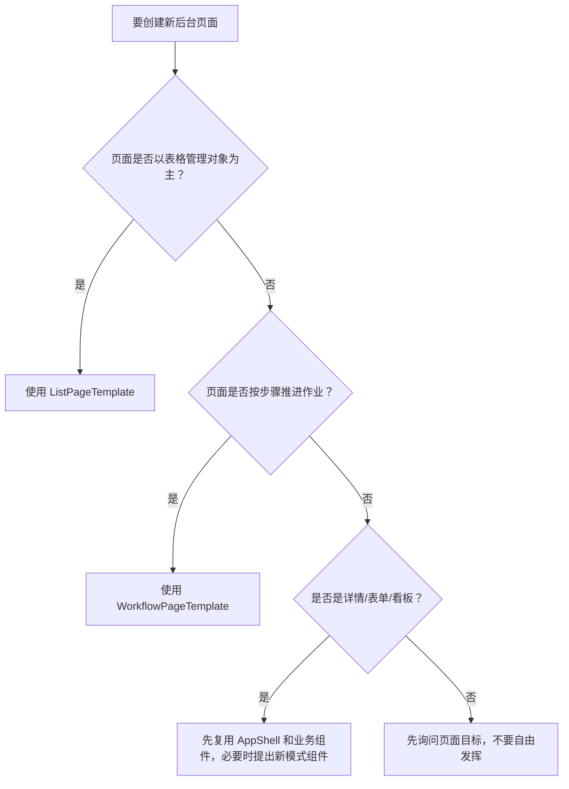

# AI Implementation Rules

这份规则给后续 AI 使用，优先级高于页面示例。AI 写页面时必须先判断页面模式，再选择模板。

## 决策树

## 列表页生成规则

1. 必须从 `src/app/templates/ListPageTemplate.tsx` 开始。
2. 必须保留 `ListPageLayout`。
3. 有 KPI 就放入 `KpiGrid`，没有 KPI 可以省略 `kpis`。
4. 有筛选就放入 `FilterBar`。
5. 表格必须放入 `DataTableShell`。
6. 状态列必须用 `StatusBadge`。
7. 不得新增局部 `getStatusBadge`。

## 作业流页面生成规则

1. 必须从 `src/app/templates/WorkflowPageTemplate.tsx` 开始。
2. 必须保留 `WorkflowPageLayout`。
3. 必须定义 `workflowSteps`。
4. 扫描或输入作业对象必须用 `ScanInputPanel`。
5. 数量进度必须用 `QuantityProgress`。
6. 操作记录必须用 `OperationLogList`。
7. 异常处理必须用 `ExceptionDialog`。

## 迁移其他系统时的替换范围

| 可以改 | 不应改 |
|---|---|
| `configs/*` | `components/ui/*` |
| `types/*` | `AppShell.tsx` 的基础布局逻辑 |
| service/mock 或 API | `StatusBadge` 的 tone 语义 |
| 页面字段和路由 | `ListPageLayout` 的基本结构 |
| theme token | `WorkflowPageLayout` 的基本结构 |

## 输出前自检

AI 完成页面后必须检查：

1. 是否还有硬编码品牌色。
2. 是否还有局部 `getStatusBadge`。
3. 是否列表页散拼 Card。
4. 是否作业流页散拼步骤条或扫描框。
5. 是否运行了 `npm run typecheck` 和 `npm run build`。

## 常见错误

| 错误 | 正确做法 |
|---|---|
| 只复制 `globals.css` | 同时复制组件、布局、模板、规则文档。 |
| 从 WMS 页面整页复制 | 从模板开始，再参考 WMS 页面细节。 |
| 在页面里写 `bg-green-100` | 写 statusMap，然后使用 `StatusBadge`。 |
| 为 ERP 改 `WMSLayout` | 新建 `ERPLayout` 包装 `AppShell`。 |
| 每页写一套扫描输入框 | 使用 `ScanInputPanel`。 |
